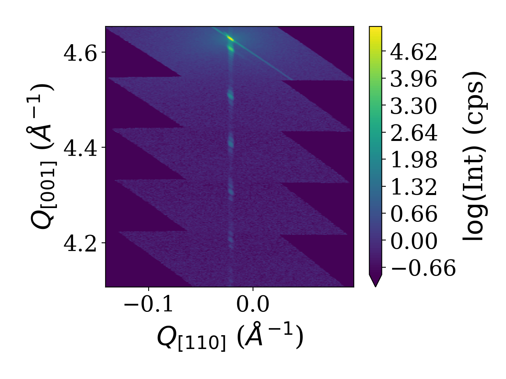
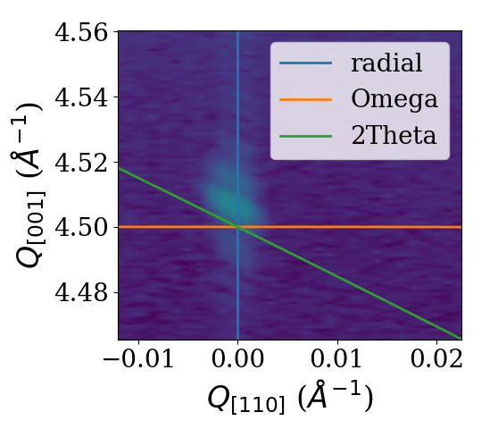
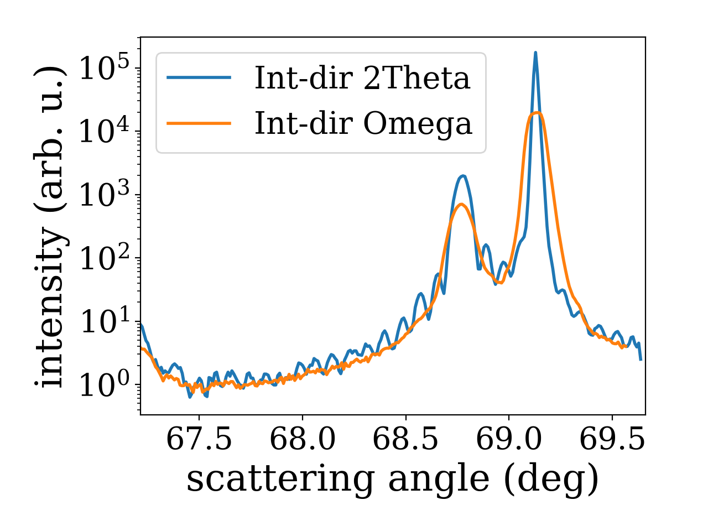
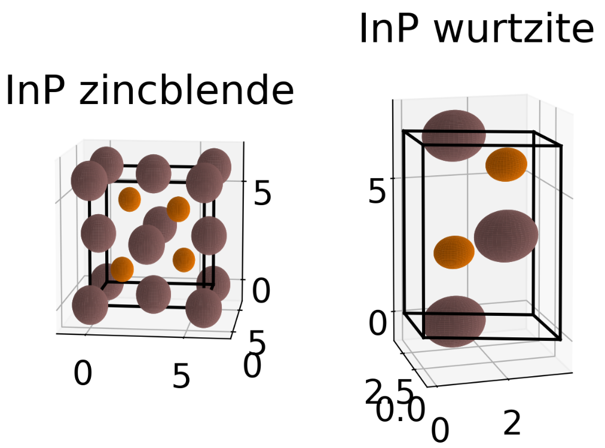
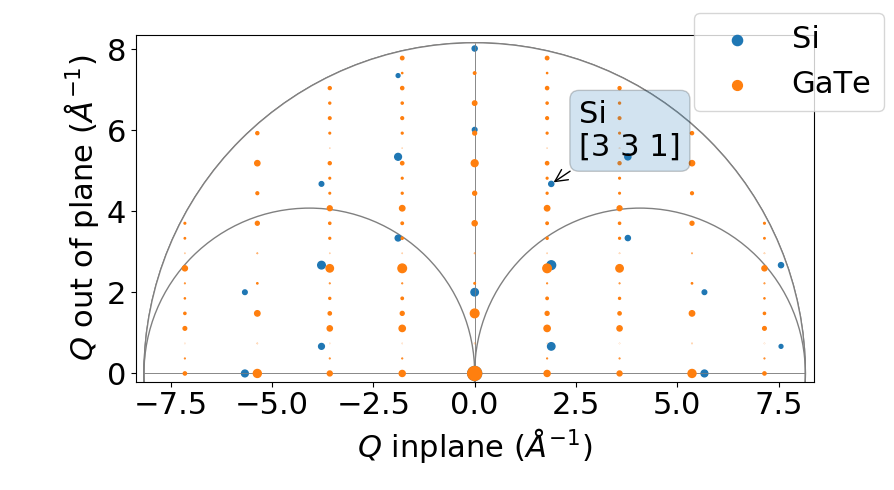

.. highlight:: python
   :linenothreshold: 5

.. _examplespage:

Examples
========

In the following a few code-snippets are shown which should help you getting started with *xrayutilities*. Not all of the codes shown in the following will be run-able as stand-alone script. For fully running scripts look in the ``examples`` directory in the download found `here <https://sourceforge.net/projects/xrayutilities>`_.

Reading data from data files
----------------------------

The ``io`` submodule provides classes for reading x-ray diffraction data in
various formats. In the following few examples are given.

Reading SPEC files
^^^^^^^^^^^^^^^^^^

Working with spec files in *xrayutilities* can be done in two distinct ways.
 1. parsing the spec file for scan headers; and parsing the data only when needed
 2. parsing the spec file for scan headers; parsing all data and dump them to an HDF5 file; reading the data from the HDF5 file.

Both methods have their pros and cons. For example when you parse the spec-files over a network connection you need to re-read the data again over the network if using method 1) whereas you can dump them to a local file with method 2). But you will parse data of the complete file while dumping it to the HDF5 file.

Both methods work incremental, so they do not start at the beginning of the file when you reread it, but start from the last position they were reading and work with files including data from linear detectors.

An working example for both methods is given in the following.

.. code-block:: python

    import xrayutilities as xu
    import os

    # open spec file or use open SPECfile instance
    try: s
    except NameError:
        s = xu.io.SPECFile("sample_name.spec", path="./specdir")

    # method (1)
    s.scan10.ReadData()
    scan10data = s.scan10.data

    # method (2)
    h5file = os.path.join("h5dir", "h5file.h5")
    s.Save2HDF5(h5file) # save content of SPEC file to HDF5 file
    # read data from HDF5 file
    [angle1, angle2], scan10data = xu.io.geth5_scan(h5file, [10],
                                                    "motorname1",
                                                    "motorname2")

.. seealso::
   the fully working example :ref:`helloworld`

In the following it is shown how to re-parsing the SPEC file for new scans and reread the scans (1) or update the HDF5 file(2)

.. code-block:: python

    s.Update() # reparse for new scans in open SPECFile instance

    # reread data method (1)
    s.scan10.ReadData()
    scan10data = s.scan10.data

    # reread data method (2)
    s.Save2HDF5(h5) # save content of SPEC file to HDF5 file
    # read data from HDF5 file
    [angle1, angle2], scan10data = xu.io.geth5_scan(h5file, [10],
                                                    "motorname1",
                                                    "motorname2")

Reading EDF files
^^^^^^^^^^^^^^^^^

EDF files are mostly used to store CCD frames at ESRF recorded from various different detectors. This format is therefore used in combination with SPEC files. In an example the EDFFile class is used to parse the data from EDF files and store them to an HDF5 file. HDF5 if perfectly suited because it can handle large amount of data and compression.

.. code-block:: python

    import xrayutilities as xu
    import numpy

    specfile = "specfile.spec"
    h5file = "h5file.h5"

    s = xu.io.SPECFile(specfile)
    s.Save2HDF5(h5file) # save to hdf5 file

    # read ccd frames from EDF files
    for i in range(1, 1001, 1):
        efile = "edfdir/sample_%04d.edf" % i
        e = xu.io.edf.EDFFile(efile)
        e.ReadData()
        e.Save2HDF5(h5file, group="/frelon_%04d" % i)

.. seealso::
   the fully working example provided in the ``examples`` directory perfectly suited for reading data from beamline ID01

Reading XRDML files
^^^^^^^^^^^^^^^^^^^

Files recorded by `Panalytical <http://www.panalytical.com>`_ diffractometers in the ``.xrdml`` format can be parsed.
All supported file formats can also be parsed transparently when they are saved as compressed files using common compression formats. The parsing of such compressed ``.xrdml`` files conversion to reciprocal space and visualization by gridding is shown below::

    import xrayutilities as xu
    om, tt, psd = xu.io.getxrdml_map('rsm_%d.xrdml.bz2', [1, 2, 3, 4, 5],
                                     path='data')
    # or using the more flexible function
    tt, om, psd = xu.io.getxrdml_scan('rsm_%d.xrdml.bz2', 'Omega',
                                      scannrs=[1, 2, 3, 4, 5], path='data')
    # single files can also be opened directly using the low level approach
    xf = xu.io.XRDMLFile('data/rsm_1.xrdml.bz2')
    # then see xf.scan and its attributes

.. seealso::
   the fully working example provided in the ``examples`` directory

Other formats
^^^^^^^^^^^^^

Other formats which can be read include

 * Rigaku ``.ras`` files.
 * files produces by the experimental control software at Hasylab/Desy (spectra).
 * numor files from the ILL neutron facility
 * ccd images in the tiff file format produced by RoperScientific CCD cameras and Perkin Elmer detectors.
 * files from recorded by Seifert diffractometer control software (``.nja``)
 * support is also provided for reading of ``cif`` files from structure
   databases to extract unit cell parameters as well es read data from those files (pdCIF, ESG files)

See the ``examples`` directory for more information and working example scripts.

Angle calculation using ``experiment`` and ``material`` classes
---------------------------------------------------------------

Methods for high angle x-ray diffraction experiments. Mostly for experiments performed in coplanar scattering geometry. An example will be given for the calculation of the position of Bragg reflections.

.. code-block:: python

    import xrayutilities as xu
    Si = xu.materials.Si  # load material from materials submodule

    # initialize experimental class with directions from experiment
    hxrd = xu.HXRD(Si.Q(1, 1, -2), Si.Q(1, 1, 1))
    # calculate angles of Bragg reflections and print them to the screen
    om, chi, phi, tt = hxrd.Q2Ang(Si.Q(1, 1, 1))
    print("Si (111)")
    print("om,tt: %8.3f %8.3f" % (om, tt))
    om, chi, phi, tt = hxrd.Q2Ang(Si.Q(2, 2, 4))
    print("Si (224)")
    print("om,tt: %8.3f %8.3f" % (om, tt))

Note that on line 5 the ``HXRD`` class is initialized without specifying the energy used in the experiment. It will use the default energy stored in the configuration file, which defaults to CuK-alpha1.

One could also call::

    hxrd = xu.HXRD(Si.Q(1, 1, -2), Si.Q(1, 1, 1), en=10000) # energy in eV

to specify the energy explicitly.
The ``HXRD`` class by default describes a four-circle goniometer as described in more detail `here <http://www.certif.com/spec_manual/fourc_4_1.html>`_.

Similar functions exist for other experimental geometries. For grazing incidence diffraction one might use

.. code-block:: python

    gid = xu.GID(Si.Q(1, -1, 0), Si.Q(0, 0, 1))
    # calculate angles and print them to the screen
    (alphai, azimuth, tt, beta) = gid.Q2Ang(Si.Q(2, -2, 0))
    print("azimuth,tt: %8.3f %8.3f" % (azimuth, tt))

There is on implementation of a GID 2S+2D diffractometer. Be sure to check if the order of the detector circles fits your goniometer, otherwise define one yourself!

There exists also a powder diffraction class, which is able to convert powder scans from angular to reciprocal space.

.. code-block:: python

    import xrayutilities as xu
    import numpy

    energy = 'CuKa12'

    # creating powder experiment
    xup = xu.PowderExperiment(en=energy)
    theta = arange(0, 70, 0.01)
    q = xup.Ang2Q(theta)

More information about powdered materials can be obtained from the :class:`~xrayutilities.simpack.powder.PowderDiffraction` class. It contains information about peak positions and intensities

.. code-block:: python

 >>> print(xu.simpack.PowderDiffraction(xu.materials.In))
    Powder diffraction object
    -------------------------
    Powder-In (volume: 1, )
    Lattice:
    a1 = (3.252300 0.000000 0.000000), 3.252300
    a2 = (0.000000 3.252300 0.000000), 3.252300
    a3 = (0.000000 0.000000 4.946100), 4.946100
    alpha = 90.000000, beta = 90.000000, gamma = 90.000000
    Lattice base:
    Base point 0: In (49) (0.000000 0.000000 0.000000) occ=1.00 b=0.00
    Base point 1: In (49) (0.500000 0.500000 0.500000) occ=1.00 b=0.00
    Reflections:
    --------------
          h k l     |    tth    |    |Q|    |    Int     |   Int (%)
       ---------------------------------------------------------------
         [0, 1, -1]    32.9338      2.312       217.24      100.00
         [0, 0, -2]    36.2964      2.541        41.69       19.19
         [-1, 1, 0]    39.1392      2.732        67.54       31.09
       [-1, -1, -2]    54.4383      3.731        50.58       23.28
       ....

If you are interested in simulations of powder diffraction patterns look at section :ref:`pdiff-simulations`

Using the ``Gridder`` classes
-----------------------------

*xrayutilities* provides Gridder classes for 1D, 2D, and 3D data sets. These Gridders map irregular spaced data onto a regular grid.
This is often needed after transforming data measured at equally spaced angular positions to reciprocal space were their spacing is irregular.

In 1D this process actually equals the calculation of a histogram.
Below you find the most basic way of using the Gridder in 2D. Other dimensions work very similar.

The most easiest use (what most user might need) is

.. code-block:: python

    import xrayutilities as xu # import Python package
    g = xu.Gridder2D(100, 101) # initialize the Gridder object, which will
    # perform Gridding to a regular grid with 100x101 points
    #====== load some data here =====
    g(x, y, data) # call the gridder with the data
    griddata = g.data # the data attribute contains the gridded data.

.. note: previously you could use the Gridder's gdata object, which was always an internal buffer and should not be used anymore!

A more complicated example showing also sequential gridding is shown below. You need sequential gridding when you can not load all data at the same time, which is often problematic with 3D data sets. In such cases you need to specify the data range before the first call to the gridder.

.. code-block:: python

    import xrayutilities as xu # import Python package
    g = xu.Gridder2D(100, 101) # initialize the Gridder object
    g.KeepData(True)
    g.dataRange(1, 2, 3, 4)  # (xgrd_min, xgrd_max, ygrd_min, ygrd_max)
    #====== load some data here =====
    g(x, y, data) # call the gridder with the data
    griddata = g.data # the data attribute contains the so far gridded data.

    #====== load some more data here =====
    g(x, y, data) # call the gridder with the new data
    griddata = g.data # the data attribute contains the combined gridded data.

Gridder2D for visualization
^^^^^^^^^^^^^^^^^^^^^^^^^^^

Based on the example of parsed data from XRDML files shown above (`Reading XRDML files`_) we show here how to use the ``Gridder2D`` class together with matplotlibs contourf.

.. code-block:: python

    Si = xu.materials.Si
    hxrd = xu.HXRD(Si.Q(1, 1, 0), Si.Q(0, 0, 1))
    qx, qy, qz = hxrd.Ang2Q(om, tt)
    gridder = xu.Gridder2D(200, 600)
    gridder(qy, qz, psd)
    INT = xu.maplog(gridder.data.transpose(), 6, 0)
    # plot the intensity as contour plot
    plt.figure()
    cf = plt.contourf(gridder.xaxis, gridder.yaxis, INT, 100, extend='min')
    plt.xlabel(r'$Q_{[110]}$ ($\mathrm{\AA^{-1}}$)')
    plt.ylabel(r'$Q_{[001]}$ ($\mathrm{\AA^{-1}}$)')
    cb = plt.colorbar(cf)
    cb.set_label(r"$\log($Int$)$ (cps)")
    plt.tight_layout()

The shown script results in the plot of the reciprocal space map shown below.

Line cuts from reciprocal space maps
------------------------------------

Using the ``analysis`` subpackage one can produce line cuts. Starting from the reciprocal space data produced by the reciprocal space conversion as in the last example code we extract radial scan along the crystal truncation rod. For the extraction of line scans the respective functions offer to integrate the data along certain directions. In the present case integration along '2Theta' gives the best result since a broadening in that direction was caused by the beam footprint in the particular experiment. For different line cut functions various integration directions are possible. They are visualized in the figure below.

.. code-block:: python

    # line cut with integration along 2theta to remove beam footprint broadening
    qzc, qzint, cmask = xu.analysis.get_radial_scan([qy, qz], psd, [0, 4.5],
                                                    1001, 0.155, intdir='2theta')

    # line cut with integration along omega
    qzc_om, qzint_om, cmask_om = xu.analysis.get_radial_scan([qy, qz], psd, [0, 4.5],
                                                    1001, 0.155, intdir='omega')
    plt.figure()
    plt.semilogy(qzc, qzint, label='Int-dir 2Theta')
    plt.semilogy(qzc_om, qzint_om, label='Int-dir Omega')
    plt.xlabel(r'scattering angle (deg)')
    plt.ylabel(r'intensity (arb. u.)')
    plt.legend()
    plt.tight_layout()

.. seealso::
   the fully working example provided in the ``examples`` directory and the other line cut functions in :class:`~xrayutilities.analysis.line_cuts`

Using the ``material`` class
----------------------------

*xrayutilities* provides a set of Python classes to describe crystal lattices and
materials.

Examples show how to define a new material by defining its lattice and deriving a new material, furthermore materials can be used to calculate the structure factor of a Bragg reflection for an specific energy or the energy dependency of its structure factor for anomalous scattering. Data for this are taken from a database which is included in the download.

First defining a new material from scratch is shown. This is done from the space group and Wyckhoff positions of the atoms inside the unit cell. Depending on the space group number the initialization of a new :class:`~xrayutilities.materials.SGLattice` object expects a different amount of parameters. For a cubic materials only the lattice parameter *a* should be given while for a triclinic materials *a*, *b*, *c*, *alpha*, *beta*, and *gamma* have to be specified. Its similar for the Wyckoff positions. While some Wyckoff positions require only the type of atom others have some free paramters which can be specified. Below we show the definition of zincblende InP as well as for its hexagonal wurtzite polytype together with a quick visualization of the unit cells. A more accurate visualization of the unit cell can be performed when using :func:`~xrayutilities.materials.Crystal.show_unitcell` with the Mayavi mode or by using the CIF-exporter and an external tool.

.. code-block:: python

    import matplotlib.pyplot as plt
    import xrayutilities as xu

    # elements (which contain their x-ray optical properties) are loaded from
    # xrayutilities.materials.elements
    In = xu.materials.elements.In
    P = xu.materials.elements.P

    # define elastic parameters of the material we use a helper function which
    # creates the 6x6 tensor needed from the only 3 free parameters of a cubic
    # material.
    elastictensor = xu.materials.CubicElasticTensor(10.11e+10, 5.61e+10,
                                                    4.56e+10)
    # definition of zincblende InP:
    InP = xu.materials.Crystal(
        "InP", xu.materials.SGLattice(216, 5.8687, atoms=[In, P],
                                      pos=['4a', '4c']),
        elastictensor)

    # a hexagonal equivalent which shows how parameters change for material
    # definition with a different space group. Since the elasticity tensor is
    # optional its not specified here.
    InPWZ = xu.materials.Crystal(
        "InP(WZ)", xu.materials.SGLattice(186, 4.1423, 6.8013,
                                          atoms=[In, P], pos=[('2b', 0),
                                                              ('2b', 3/8.)]))
    f = plt.figure()
    InP.show_unitcell(fig=f, subplot=121)
    title('InP zincblende')
    InPWZ.show_unitcell(fig=f, subplot=122)
    title('InP wurtzite')

InP (in both variants) is already included in the xu.materials module and can be loaded by

.. code-block:: python

    InP = xu.materials.InP
    InPWZ = xu.materials.InPWZ

Similar definitions exist for many other materials.

Using the material properties the calculation of the reflection strength of a Bragg reflection can be done as follows

.. code-block:: python

    import xrayutilities as xu
    import numpy

    # defining material and experimental setup
    InAs = xu.materials.InAs
    energy= 8048 # eV

    # calculate the structure factor for InAs (111) (222) (333)
    hkllist = [[1, 1, 1], [2, 2, 2], [3, 3, 3]]
    for hkl in hkllist:
        qvec = InAs.Q(hkl)
        F = InAs.StructureFactor(qvec, energy)
        print(" |F| = %8.3f" % numpy.abs(F))

Similar also the energy dependence of the structure factor can be determined

.. code-block:: python

    import matplotlib.pyplot as plt

    energy= numpy.linspace(500, 20000, 5000) # 500 - 20000 eV
    F = InAs.StructureFactorForEnergy(InAs.Q(1, 1, 1), energy)

    plt.figure(); plt.clf()
    plt.plot(energy, F.real, '-k', label='Re(F)')
    plt.plot(energy, F.imag, '-r', label='Imag(F)')
    plt.xlabel("Energy (eV)"); plt.ylabel("F"); plt.legend()

It is also possible to calculate the components of the structure factor of atoms, which may be needed for input into XRD simulations.

.. code-block:: python

    # f = f0(|Q|) + f1(en) + j * f2(en)
    import xrayutilities as xu
    import numpy

    Fe = xu.materials.elements.Fe # iron atom
    Q = numpy.array([0, 0, 1.9], dtype=numpy.double)
    en = 10000 # energy in eV

    print("Iron (Fe): E: %9.1f eV" % en)
    print("f0: %8.4g" % Fe.f0(numpy.linalg.norm(Q)))
    print("f1: %8.4g" % Fe.f1(en))
    print("f2: %8.4g" % Fe.f2(en))

Visualization of the Bragg peaks in a reciprocal space plane
^^^^^^^^^^^^^^^^^^^^^^^^^^^^^^^^^^^^^^^^^^^^^^^^^^^^^^^^^^^^

If you want to explore which peaks are available and reachable in coplanar diffraction geometry and what their relationship between different materials is ``xrayutilities`` provides a function which generates a slightly interactive plot which helps you with this task.

.. code-block:: python

    import xrayutilities as xu
    mat = xu.materials.Crystal('GaTe',
                               xu.materials.SGLattice(194, 4.06, 16.96,
                                                      atoms=['Ga', 'Te'],
                                                      pos=[('4f', 0.17),
                                                           ('4f', 0.602)]))
    ttmax = 160
    sub = xu.materials.Si
    hsub = xu.HXRD(sub.Q(1, 1, -2), sub.Q(1, 1, 1))
    ax, h = xu.materials.show_reciprocal_space_plane(sub, hsub, ttmax=160)
    hxrd = xu.HXRD(mat.Q(1, 0, 0), mat.Q(0, 0, 1))
    ax, h2 = xu.materials.show_reciprocal_space_plane(mat, hxrd, ax=ax)

The generated plot shows all the existing Bragg spots, their `(hkl)` label is shown when the mouse is over a certain spot and the diffraction angles calculated by the given :class:`~xrayutilities.HXRD` object is printed when you click on a certain spot. Not that the primary beam is assumed to come from the left, meaning that high incidence geometry occurs for all peaks with positive inplane momentum transfer.

Calculation of diffraction angles for a general geometry
--------------------------------------------------------

Often the restricted predefined geometries are not corresponding to the experimental setup, nevertheless *xrayutilities* is able to calculate the goniometer angles needed to reach a certain reciprocal space position.

For this purpose the goniometer together with the geometric restrictions need to be defined and the q-vector in laboratory reference frame needs to be specified.
This works for arbitrary goniometer, however, the user is expected to set up bounds to put restrictions to the number of free angles to obtain reproducible results.
In general only three angles are needed to fit an arbitrary q-vector (2 sample + 1 detector angles or
1 sample + 2 detector).

The example below shows the necessary code to perform such an angle calculation for a costum defined material with orthorhombic unit cell.

.. code-block:: python

    import xrayutilities as xu
    import numpy as np

    def Pnma(a, b, c):
        # create orthorhombic unit cell with space-group 62,
        # here for simplicity without base
        l = xu.materials.SGLattice(62, a, b, c)
        return l

    latticeConstants=[5.600, 7.706, 5.3995]
    SmFeO3 = xu.materials.Crystal("SmFeO3", Pnma(*latticeConstants))
    # 2S+2D goniometer
    qconv=xu.QConversion(('x+', 'z+'), ('z+', 'x+'), (0, 1, 0))
    # [1,1,0] surface normal
    hxrd = xu.HXRD(SmFeO3.Q(0, 0, 1), SmFeO3.Q(1, 1, 0), qconv=qconv)

    hkl=(2, 0, 0)
    q_material = SmFeO3.Q(hkl)
    q_laboratory = hxrd.Transform(q_material) # transform

    print('SmFeO3: \thkl ', hkl, '\tqvec ', np.round(q_material, 5))
    print('Lattice plane distance: %.4f' % SmFeO3.planeDistance(hkl))

    #### determine the goniometer angles with the correct geometry restrictions
    # tell bounds of angles / (min,max) pair or fixed value for all motors
    # maximum of three free motors! here incidence angle fixed to 5 degree
    # om, phi, tt, delta
    bounds = (5, (-180, 180), (-1, 90), (-1, 90))
    ang,qerror,errcode = xu.Q2AngFit(q_laboratory, hxrd, bounds)
    print('err %d (%.3g) angles %s' % (errcode, qerror, str(np.round(ang, 5))))
    # check that qerror is small!!
    print('sanity check with back-transformation (hkl): ',
          np.round(hxrd.Ang2HKL(*ang,mat=SmFeO3),5))

User-specific config file
-------------------------

Several options of *xrayutilities* can be changed by options in a config file. This includes the default x-ray energy as well as parameters to set the number of threads used by the parallel code and the verbosity of the output.

The default options are stored inside the installad Python module and should not be changed. Instead it is suggested to use a user-specific config file
'~/.xrayutilities.conf' or a 'xrayutilities.conf' file in the working directory.

An example of such a user config file is shown below:

.. code-block:: python

    # begin of xrayutilities configuration
    [xrayutilities]

    # verbosity level of information and debugging outputs
    #   0: no output
    #   1: very import notes for users
    #   2: less import notes for users (e.g. intermediate results)
    #   3: debuging output (e.g. print everything, which could be interesing)
    #   levels can be changed in the config file as well
    verbosity = 1

    # default wavelength in Angstrom,
    wavelength = MoKa1 # Molybdenum K alpha1 radiation (17479.374eV)

    # default energy in eV
    # if energy is given wavelength settings will be ignored
    #energy = 10000 #eV

    # number of threads to use in parallel sections of the code
    nthreads = 1
    #   0: the maximum number of available threads will be used (as returned by
    #      omp_get_max_threads())
    #   n: n-threads will be used

Determining detector parameters
-------------------------------

In the following three examples of how to determine the detector parameters for linear and area detectors is given.
The procedure we use is in more detail described in this `article <http://arxiv.org/abs/1304.1732>`_.

Linear detectors
^^^^^^^^^^^^^^^^

To determine the detector parameters of a linear detector one needs to perform a scan with the detector angle through the primary beam and aquire a detector spectrum at any point.

Using the following script determines the parameters necessary for the detector initialization, which are:

* pixelwidth of one channel
* the center channel
* and the detector tilt (optional)

.. literalinclude:: example_xu_linear_detector_parameters.py
    :linenos:
    :language: python

Area detector (Variant 1)
^^^^^^^^^^^^^^^^^^^^^^^^^

To determine the detector parameters of a area detector one needs to perform scans with the detector angles through the primary beam and aquire a detector images at any position.
For the area detector at least two scans (one with the outer detector and and one with the inner detector angle) are required.

Using the following script determines the parameters necessary for the detector initialization from such scans in the primary beam only. Further down we discuss an other variant which is also able to use additionally detector images recorded at the Bragg reflection of a known reference crystal.

The determined detector parameters are:

* center channels: position of the primary beam at the true zero position of the goniometer (considering the outer angle offset) (2 parameters)
* pixelwidth of the channels in both directions (2 parameters), these two parameters can be replaced by the detector distance (1 parameter) if the pixel size is given as an input
* detector tilt azimuth in degree from 0 to 360
* detector tilt angle in degree (>0deg)
* detector rotation around the primary beam in degree
* outer angle offset, which describes a offset of the outer detector angle from its true zero position

The misalignment parameters as well as the pixel size can be fixed during the fitting.

.. literalinclude:: example_xu_ccd_parameter.py
    :linenos:
    :language: python

A possible output of this script could be

    fitted parameters: epsilon: 8.0712e-08 (2,['Parameter convergence'])
    param: (cch1,cch2,pwidth1,pwidth2,tiltazimuth,tilt,detrot,outerangle_offset)
    param: 140.07 998.34 4.4545e-05 4.4996e-05 72.0 1.97 -0.792 -1.543
    please check the resulting data (consider setting plot=True)
    detector rotation axis / primary beam direction (given by user): ['z+', 'y-'] / x+
    detector pixel directions / distance: z- y+ / 1
    detector initialization with: init_area('z-', 'y+', cch1=140.07,
    cch2=998.34, Nch1=516, Nch2=516, pwidth1=4.4545e-05, pwidth2=4.4996e-05,
    distance=1., detrot=-0.792, tiltazimuth=72.0, tilt=1.543)
    AND ALWAYS USE an (additional) OFFSET of -1.9741deg in the OUTER DETECTOR ANGLE!

The output gives the fitted detector parameters and compiles the Python code line one needs to use to initialize the detector.
Important to note is that the outer angle offset which was determined by the fit (-1.9741 degree in the aboves example) is not included in the initialization of the detector parameters *but* needs to be used in every call to the q-conversion function as offset.
This step needs to be performed manually by the user!

Area detector (Variant 2)
^^^^^^^^^^^^^^^^^^^^^^^^^

In addition to scans in the primary beam this variant enables also the use of detector images recorded in scans at Bragg reflections of a known reference materials. However this also required that the sample orientation and x-ray wavelength need to be fit.
To keep the additional parameters as small as possible we only implemented this for symmetric coplanar diffractions.

The advantage of this method is that it is more sensitive to the outer angle offset also at large detector distances.
The additional parameters are:

* sample tilt angle in degree
* sample tilt azimuth in degree
* and the x-ray wavelength in Angstrom

.. literalinclude:: example_xu_ccd_parameter_hkl.py
    :linenos:
    :language: python

