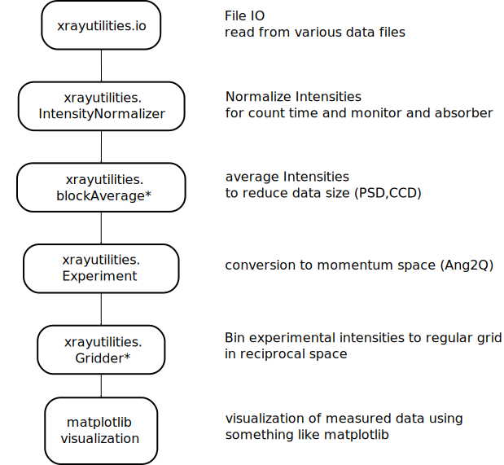
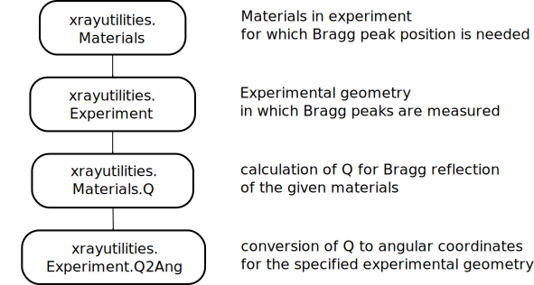

.. xrayutilities documentation master file, created by
   sphinx-quickstart on Sat Mar  2 11:39:01 2013.
   You can adapt this file completely to your liking, but it should at least
   contain the root `toctree` directive.

Welcome to xrayutilities's documentation!
=========================================

If you look for downloading the package go to `Sourceforge <https://sourceforge.net/projects/xrayutilities>`_ or `GitHub <https://github.com/dkriegner/xrayutilities>`_ (source distribution) or the `Python package index <https://pypi.python.org/pypi/xrayutilities>`_ (MS Windows binary).

Read more about *xrayutilities* below or in `Journal of Applied Crystallography 2013, Volume 46, 1162-1170 <http://dx.doi.org/10.1107/S0021889813017214>`_

Installation
============

The easiest way to install *xrayutilities* is using the `Python package index version <https://pypi.python.org/pypi/xrayutilities>` and execute

.. code-block:: bash

 > pip install xrayutilities

If you prefer the installation from sources see the `Source Installation`_ below.

Introduction
============

Mailing list and issue tracker
------------------------------

To get in touch with us or report an issue please use the `mailing list <https://sourceforge.net/p/xrayutilities/mailman/xrayutilities-users/>`_ or the `Github issue tracker <https://github.com/dkriegner/xrayutilities/issues>`_.
When you want to follow announcements of major changes or new releases its recommended to `sign up for the mailing list <https://sourceforge.net/projects/xrayutilities/lists/xrayutilities-users>`_

Overview
--------

*xrayutilities* is a collection of scripts used to analyze and simulate x-ray diffraction data. It consists of a python package and several routines coded in C.
It especially useful for the reciprocal space conversion of diffraction data taken with linear and area detectors. Several models for the simulation of thin film reflectivity and diffraction curves are included.

In the following few concepts of usage for the *xrayutilities* package will be described.
First one should get a brief idea of how to analyze x-ray diffraction data with *xrayutilities*.
Following that the concept of how angular coordinates of Bragg reflections are calculated is presented.
Before describing in detail the installation a minimal example for thin film simulations is shown.

Concept of usage
----------------

*xrayutilities* provides a set of functions to read experimental data from various data file formats.
All of them are gathered in the :mod:`io`-subpackage.
After reading data with a function from the io-submodule the data might be corrected for monitor counts and/or absorption factor of a beam attenuator.
A special set of functions is provided to perform this for point, linear and area detectors.

Since the amount of data taken with modern detectors often is too large to be able to work with them properly, a functions for reducing the data from linear and area detectors are provided.
They use block-averaging to reduce the amount of data.
Use those carefully not to loose the features you are interested in in your measurements.

After the pre-treatment of the data, the core part of the package is the transformation of the angular data to reciprocal space.
This is done as described in more detail below using the :mod:`experiment`-module`.
The classes provided within the experiment module provide routines to help performing X-ray diffraction experiments.
This includes methods to calculate the diffraction angles (described below) needed to align crystalline samples and to convert data between angular and reciprocal space.
The conversion from angular to reciprocal space is implemented very general for various goniometer geometries.
It is especially useful in combination with linear and area detectors as described in this `article <http://dx.doi.org/10.1107/S0021889813017214>`_.
In standard cases, Users will only need the initialized routines, which predefine a certain goniometer geometry like the popular four-cirlce and six-circle geometries.

After the conversion to reciprocal space, it is convenient to transform the data to a regular grid for visualization.
For this purpose the :mod:`gridder`-module has been included into *xrayutilities*.
For the visualization of the data in reciprocal space the usage of `matplotlib <http://matplotlib.org>`_ is recommended.

A practical example showing the usage is given below.

Angle calculation using the material classes
--------------------------------------------

Calculation of angles needed to align Bragg reflections in various diffraction geometries is done using the Materials defined in the :mod:`materials`-package.
This package provides a set of classes to describe crystal lattices and materials.
Once such a material is properly defined one can calculate its properties, which includes the reciprocal lattice points, lattice plane distances, optical properties like
the refractive index, the structure factor (including the atomic scattering factor) and the complex polarizability.
These atomic properties are extracted from a database included in *xrayutilities*.

Using such a material and an experimental class from the :mod:`experiment`-module, describing the experimental setup, the needed diffraction angles can be calculated for certain coplanar diffraction (high, low incidence), grazing incidence diffraction and also special non-coplanar diffraction geometries.
In the predefined experimental classes fixed geometries are used. For angle calculation of custom geometries using arbitrary geometries (max. of three free angles) the :mod:`q2ang_fit`-module can be used as described in one of the included example files.

.. _helloworld:

hello world
-----------

A first example with step by step explanation is shown in the following.
It showcases the use of *xrayutilities* to calculate angles and read a scan recorded with a linear detector from `spec <http://www.certif.com>`_-file and plots
the result as reciprocal space map using matplotlib.

.. literalinclude:: example_xu_read_spec_easy.py
    :linenos:
    :language: python

More such examples can be found on the :ref:`examplespage` page.

X-ray diffraction and reflectivity simulations
----------------------------------------------

**xrayutilties** includes a database with optical properties of materials and therefore simulation of reflectivity and diffraction data can be accomplished with relatively litte additional input. When the stack of layers is defined along with the layer thickness and material several models for calculation of X-ray reflectivity and dynamical/kinematical X-ray diffraction are provided.

A minimal example for an AlGaAs superlattice structure is shown below. It shows how a basic stack of a superlattice is built from its ingredients and how the reflectivity and dynamical diffraction model are initialized in the most basic form::

    import xrayutilities as xu
    # Build the pseudomorphic sample stack using the elastic parameters
    sub = xu.simpack.Layer(xu.materials.GaAs, inf)
    lay1 = xu.simpack.Layer(xu.materials.AlGaAs(0.25), 75, relaxation=0.0)
    lay2 = xu.simpack.Layer(xu.materials.AlGaAs(0.75), 25, relaxation=0.0)
    pls = xu.simpack.PseudomorphicStack001('pseudo', sub+10*(lay1+lay2))
    # simulate reflectivity
    m = xu.simpack.SpecularReflectivityModel(pls, sample_width=5, beam_width=0.3)
    alphai = linspace(0, 10, 1000)
    Ixrr = m.simulate(alphai)
    # simulate dynamical diffraction curve
    alphai = linspace(29, 38, 1000)
    md = xu.simpack.DynamicalModel(pls)
    Idyn = md.simulate(alphai, hkl=(0, 0, 4))

More detailed examples and description of model parameters can be found on the :ref:`simulationspage` page or in the ``examples`` directory.

xrayutilities Python package
============================

.. automodule:: xrayutilities
   :members:
   :undoc-members:
   :show-inheritance:

for more details see the full API documentation of :mod:`xrayutilities` found here: :ref:`expapi`.

Source Installation
===================

Express instructions
--------------------

 * install the dependencies (Windows: `Python(x,y) <https://python-xy.github.io/>`_ or `WinPython <https://winpython.github.io/>`_; Linux/Unix: see below for dependencies).
 * download *xrayutilities* from `here <https://sourceforge.net/projects/xrayutilities>`_ or use git to check out the `latest <https://github.com/dkriegner/xrayutilities>`_ version.
 * open a command line and navigate to the downloaded sources and execute:

.. code-block:: bash

 > pip install .

which will install *xrayutilities* to the default directory. It should be possible to use it (*import xrayutilities*) from now on in python scripts.

Detailed instructions
---------------------

Installing *xrayutilities* is done using Python's setuptools

The package can be installed on Linux, Mac OS X and Microsoft Windows, however, it is mostly tested on Linux/Unix platforms.
Please inform one of the authors in case the installation fails!

Required third party software
-----------------------------

To keep the coding effort as small as possible *xrayutilities* depends on a
large number of third party libraries and Python modules.

The needed runtime dependencies are:
 * **Python** the scripting language in which most of *xrayutilities* code is written in. (>= 3.6, for Python 2.7 use *xrayutilities* 1.5.X or older)
 * **Numpy** a Python module providing numerical array objects (version >= 1.9)
 * **Scipy** a Python module providing standard numerical routines, which is heavily using numpy arrays (version >= 0.13.0)
 * **h5py** a powerful Python interface to HDF5.

For several features optional dependencies are needed:
 * **Matplotlib** a Python module for high quality 1D and 2D plotting (optional, version >= 3.1.0)
 * **lmfit** a Python module for least-squares minimization with bounds and constraints (optionally needed for fitting XRR/XRD data)
 * **IPython** although not a dependency of *xrayutilities* the IPython shell is perfectly suited for the interactive use of the *xrayutilities* python package.
 * **mayavi** only used optionally in Crystal.show_unitcell where it produces a superior visualization to otherwise used Matplotlib 3D plots

Additionally, the following Python modules are needed when building *xrayutilities* from source:
 * **C-compiler** Gnu Compiler Collection or any compatible C compiler. On windows you most probably want to use the Microsoft compilers.
 * **Python dev header**
 * **unittest2** needed for running the unit tests (optional)

For building the documention (which you do not need to do) the requirements are:
 * **sphinx** the Python documentation generator
 * **numpydoc** sphinx-extension needed to parse the API-documention
 * **rst2pdf** pdf-generation using sphinx

After installing all required packages you can continue with installing and
building the C library.

Building and installing the library and python package
------------------------------------------------------

Although the *setup.py* script can be called manually its recommended to always use pip to install *xrayutilities*, which can be done by executing

.. code-block:: bash

 >pip install .

or

.. code-block:: bash

 >pip install --prefix=INSTALLPATH .

in the root directory of the source distribution.

The *--prefix* option sets the root directory for the installation. If it is omitted
the libary is installed under the systems default directories (recommended).

Setup of the Python package
---------------------------

You need to make your Python installation aware of where to look for the module.
This is usually only needed when installing in non-standard *<install path>* locations.
For this case append the installation directory to your *PYTHONPATH* environment variable by

.. code-block:: bash

 >export PYTHONPATH=$PYTHONPATH:<local install path>/lib64/python2.7/site-packages

on a Unix/Linux terminal. Or, to make this configuration persistent append this line to
your local *.bashrc* file in your home directory.
On MS Windows you would like to create a environment variable in the system
preferences under system in the advanced tab (Using Python package managers
this should be done automatically). Be sure to use the correct directory which
might be similar to

.. code-block:: bash

 <local install path>/Lib/site-packages

on Windows systems.

Notes for installing on Windows
-------------------------------

Since there is no packages manager on Windows the packages need to be installed manual
(including all the dependecies) or a pre-packed solution needs two be used. We strongly suggest to
use either `Anaconda <https://www.anaconda.com/distribution/>`_, `Python(x,y) <https://python-xy.github.io/>`_ or
`WinPython <https://winpython.github.io/>`_ Python distributions,
which include already all of the needed dependencies for installing *xrayutilities*.

One can proceed with the installation of *xrayutilities* directly!
The easiest way to do this on windows is to use the binaries distributed on the `Python package index <https://pypi.python.org/pypi/xrayutilities>`_ or using *pip*, otherwise one can follow the general installation instructions. On Anaconda it can also be done using the `conda-forge *xrayutilities* package <https://anaconda.org/conda-forge/xrayutilities>`_.

.. _expapi:

Examples and API-documentation
==============================

.. toctree::
   :maxdepth: 2

   examples
   simulations
   xrayutilities
   xrayutilities.analysis
   xrayutilities.io
   xrayutilities.materials
   xrayutilities.math
   xrayutilities.simpack   
   modules

Indices and tables
==================

* :ref:`genindex`
* :ref:`modindex`
* :ref:`search`

