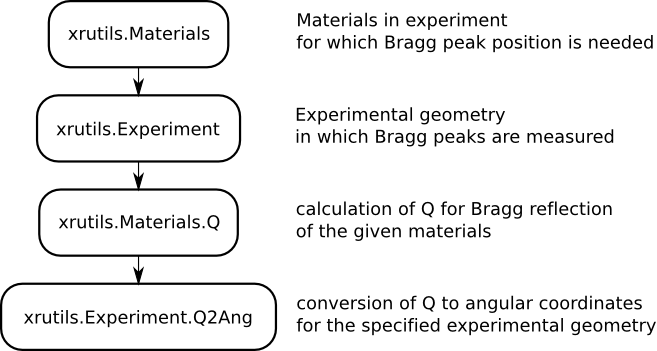

.. xrayutilities documentation master file, created by
   sphinx-quickstart on Sat Mar  2 11:39:01 2013.
   You can adapt this file completely to your liking, but it should at least
   contain the root `toctree` directive.

Welcome to xrayutilities's documentation!
=========================================

If you look for downloading the package go `here <https://sourceforge.net/projects/xrayutilities>`_.
Installation instructions you find further down `Installation`_.

  
Introduction
============

*xrayutilities* is a collection of scripts used to analyze x-ray diffraction data. It consists of a python package and several routines coded in C.
It especially useful for the reciprocal space conversion of diffraction data taken with linear and area detectors.

In the following two concepts of usage for the *xrayutilities* package will be described.
First one should get a brief idea of how to analyze x-ray diffraction data with *xrayutilities*.
After that the concept of how angular coordinates of Bragg reflections are calculated is presented.

Concept of usage
----------------

.. image:: pics/xrutils_usage.png
    :width: 400px
    :align: right
    :alt: Flow diagram showing how to analyze x-ray diffraction data using xrutils

*xrayutilities* provides a set of functions to read experimental data from various data file formats.
All of them are gathered in the :ref:`io-subpackage`.
After reading data with a function from the io-submodule the data might be need to be corrected for monitor counts and or absorber corrected.
A special set of functions is provided to perform this for point and linear detectors.

Since the amount of data taken with modern detectors often is too large to be able to work with them properly a function for reducing the data from linear and are detectors are provided. They use block-averaging to reduce the amount of data. Use those carefully not to loose the featured you are interested in your measurements.

After the pre-treatment of the data the core part of the package is the transformation of the angular data to reciprocal space. This is done as described in more detail below using the :ref:`experiment-module`. 
The classes provided within the experiment module provide routines to help performing
X-ray diffraction experiments. This includes methods to calculate the diffraction
angles (described below) needed to align samples and to convert data between angular and recip-
rocal space. The conversion from angular to reciprocal space is implemented
very general for various goniometer geometries. It is especially useful in combination with linear and area detectors as described in (arxiv link)
Users should in normal cases only need the initialized routines, which predefine a certain goniometer geometry like the popular four-cirlce and six-circle geometry.

After the conversion to reciprocal space in order to visualize the data it is convenient to transform them to a regular grid in reciprocal space. 
For this purpose in *xrayutilities* the :ref:`gridder-module` is included.
For the visualization of the data in reciprocal space the usage of `matplotlib <http://matplotlib.org>`_ is recommended.

A practical example showing the usage is given below.

Angle calculation using the material classes
--------------------------------------------

Calculation of angles needed to align Bragg reflections in various diffraction geometries is done using the Materials defined in the :ref:`material-package`.
This package provides a set of classes to describe crystal lattices and materials.
Once such a material is properly defined one can calculate its properties, which includes the reciprocal lattice points, optical properties like 
the refractive index, the structure factor (including the atomic scattering factor) and the complex polarizability.
These atomic properties are extracted from a database included in *xrayutilities*.

Using such a material and an experimental class from the :ref:`experiment-module` describing the experimental setup the needed diffraction angles can be calculated for certain coplanar diffraction (high, low incidence), grazing incidence diffraction and also special non-coplanar diffraction geometries.

.. _helloworld:

hello world
-----------

A first example with step by step explanation is shown in the following.
It showcases the use of *xrayutilities* to calculate angles and read a scan recorded with a linear detector from `spec <http://www.certif.com>`_-file and plots
the result as reciprocal space map using matplotlib.

.. literalinclude:: example_xrutils_read_spec_easy.py
    :linenos:
    :language: python

More such examples can be found on the :ref:`examplespage` page.

xrutils Python package
======================

.. automodule:: xrutils
   :members:
   :undoc-members:
   :show-inheritance:

for more details see the full :ref:`API-documentation`

Installation
============

Express instructions
--------------------

 * install the dependencies (Windows: `pythonxy <http://www.pythonxy.com>`_, `SCons <http://www.scons.org>`_; Linux/Unix: see below for dependencies).
 * download *xrayutilities* from `here <https://sourceforge.net/projects/xrayutilities>`_ or use git to check out the `latest <https://sourceforge.net/p/xrayutilities/code/>`_ version.
 * open a command line and navigate to the downloaded sources and execute:

.. code-block:: bash
    
 > scons install

which will install *xrayutilities* to the default directory. It should be possible to use it (*import xrutils*) from now on in python scripts. 

.. note:: The python package of *xrayutilities* is called ''xrutils''

Detailed instructions
---------------------

Installing *xrayutilities* is a two steps process
 * install required C libraries and Python modules
 * build and install the *xrayutilities* C library and Python module

All steps are described in detail below and are performed by the SCons installer. 
The package can be installed on Linux, Mac OS X and Microsoft Windows, however it is mostly tested on Linux/Unix platforms. 
Please inform one of the authors in case the installation fails!

Required third party software
-----------------------------

To keep the coding effort as small as possible *xrayutilities* depends on a 
large number of third party libraries and Python modules. 

The needed dependencies are: 
 * **GCC** Gnu Compiler Collection or any compatible C compiler. On windows you most probably should use MinGW or CygWin. Others might work but are untested.
 * **HDF5** a versatile binary data format (library is implemented in C).
   Although the library is not called directly, it is needed by the pytables Python
   module (see below).
 * **Python** the scripting language in which most of *xrayutilities* code is written in.
 * **Scons** a pythonic autotools/make replacement used for building the C library.
 * **git** a version control system used to keep track on the *xrayutilities* development. (only needed for development)

Additionally, the following Python modules are needed in order to make *xrayutilities* work as intended:
 * **Numpy** a Python module providing numerical array objects
 * **Scipy** a Python module providing standard numerical routines, which is heavily using numpy arrays
 * **Python-Tables** a powerful Python interface to HDF5. 
 * **Matplotlib** a Python module for high quality 1D and 2D plotting (optionally)
 * **IPython** although not a dependency of *xrayutilities* the IPython shell is perfectly suited for the interactive use of the *xrayutilities* python package.

After installing all required packages you can continue with installing and
building the C library.

Building and installing the library and python package
------------------------------------------------------

*xrayutilities* uses the SCons build system to compile the C components of the
system. You can build the library simply by typing 

.. code-block:: bash
 
 >scons

in the root directory of the source distribution. To build using debug flags ({\tt -g -O0}) type

.. code-block:: bash
 
 >scons debug=1

instead. After building, the library and python package are installed by

.. code-block:: bash

 >scons install --prefix=<install path>

The library is installed in *<install path>/lib*. Installation of the Python module 
is done via the *distutils* package (called by SCons automatically).
The *--prefix* option sets the root directory for the installation. If it is omitted
the libary is installed under /usr/lib/ on Unix systems or in the Python installation directory on Windows.

Setup of the Python package
---------------------------

You need to make your Python installation aware of where to look for the module.
This is usually only needed when installing in non-standard *<install path>* locations.
For this case append the installation directory to your *PYTHONPATH* environment variable by 

.. code-block:: bash
 
 >export PYTHONPATH=$PYTHONPATH:<local install path>/lib64/python2.7/site-packages

on a Unix/Linux terminal. Or, to make this configuration persistent append this line to
your local *.bashrc* file in your home directory. 
On MS Windows you would like to create a environment variable in the 
system preferences under system in the advanced tab (Using pythonxy this is done automatically).
Be sure to use the correct directory which might be similar to 

.. code-block:: bash
 
 <local install path>/Lib/site-packages

on Windows systems.

Notes for installing on Windows
-------------------------------

Since there is no packages manager on Windows the packages need to be installed manual 
(including all the dependecies) or a pre-packed solution needs to be used. We strongly suggest to
use the `pyhton(x,y) <https://code.google.com/p/pythonxy/>`_ python distribution, 
which includes already most of the needed dependencies for installing *xrayutilities*.

When using python(x,y) you only have to install SCons in addition (download the latest version from `www.scons.org <http://www.scons.org>`_). 
All other dependencies are available as plugins to python(x,y) 
and are installed by default anyhow. The setup of the environment variables is also done by the python(x,y) installation.
One can proceed with the installation of *xrayutilities* directly!

In case you want to do it the hard way install all of the following (versions in brackets indicate the tested set of versions by the author (2.3.2012)):
 * MinGW (0.4alpha)
 * Python (2.7.2)
 * scons (2.1.0)
 * numpy (1.6.1)
 * scipy (0.10.1)
 * numexpr (1.4.2) needed for pytables
 * pytables (2.3.1)
 * matplotlib (1.1.0)
 * ipython (0.12)

It is suggested to add the MinGW binary directory, as well as the Python and Python-scripts directory
to the Path environment variable as described above! Installation is done as described above. 

Examples and API-documentation
==============================

.. toctree::
   :maxdepth: 2
    
   examples 
   xrutils
   xrutils.analysis
   xrutils.io
   xrutils.materials
   xrutils.math
   modules
   
   
Indices and tables
==================

* :ref:`genindex`
* :ref:`modindex`
* :ref:`search`

