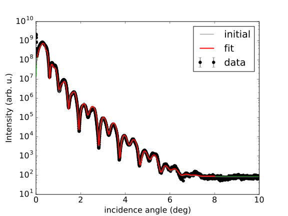
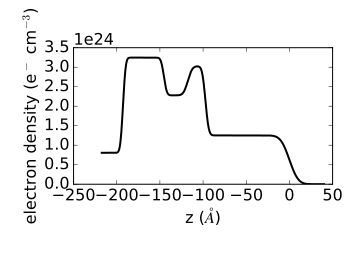
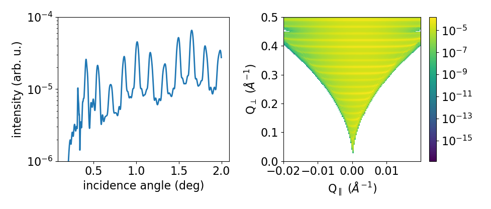
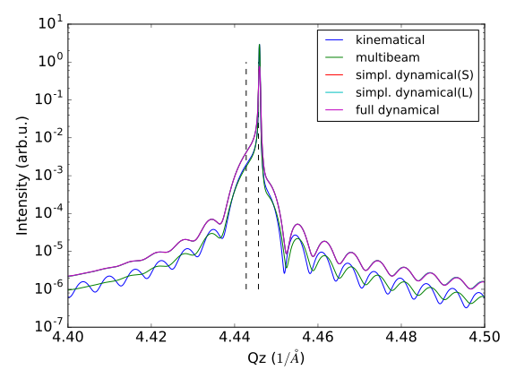
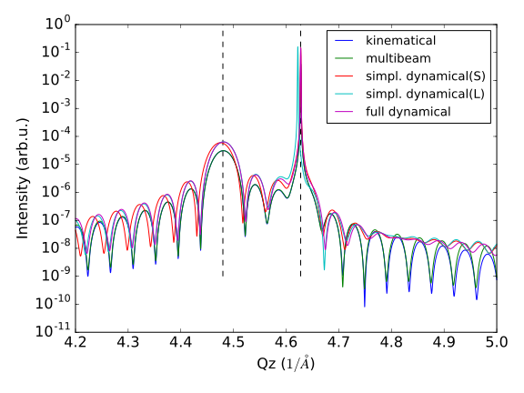
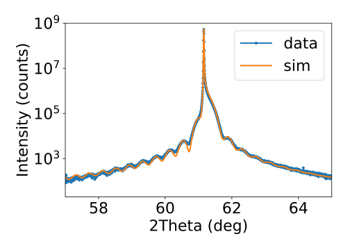

.. highlight:: python
   :linenothreshold: 5

.. _simulationspage:

Simulation examples
===================

In the following a few code-snippets are shown which should help you getting started with reflectivity and diffraction simulations using *xrayutilities*. All simulations in *xrayutilities* are for layers systems and currently there are no plans to extend this to other geometries. Note that not all of the codes shown in the following will be run-able as stand-alone scripts. For fully running scripts look in the ``examples`` directory in the download found `here <https://sourceforge.net/projects/xrayutilities>`_.

Building Layer stacks for simulations
-------------------------------------

The basis of all simulations in *xrayutilities* are stacks of layers. Therefore several functions exist to build up such layered systems. The basic building block of all of them is a :class:`~xrayutilities.simpack.smaterials.Layer` object which takes a material and its thickness in ångström as initializing parameter.::

    import xrayutilities as xu
    lay = xu.simpack.Layer(xu.materials.Si, 200)

In the shown example a silicon layer with 20 nm thickness is created. The first argument is the material of the layer. For diffraction simulations this needs to be derived from the :class:`~xrayutilities.materials.material.Crystal`-class. This means all predefined materials in *xrayutitities* can be used for this purpose. For x-ray reflectivity simulations, however, also knowing the chemical composition and density of the material is sufficient.

A 5 nm thick metallic CoFe compound layer can therefore be defined by::

    rho_cf = 0.5*8900 + 0.5*7874  # mass density in kg/m^3
    mCoFe = xu.materials.Amorphous('CoFe', rho_cf)
    lCoFe = xu.simpack.Layer(mat_cf, 50)

.. note:: The :class:`~xrayutilities.simpack.smaterials.Layer` object can have several more model dependent properties discussed in detail below.

When several layers are defined they can be combined to a :class:`~xrayutilities.simpack.smaterials.LayerStack` which is used for the simulations below.::

    sub = xu.simpack.Layer(xu.materials.Si, inf)
    lay1 = xu.simpack.Layer(xu.materials.Ge, 200)
    lay2 = xu.simpack.Layer(xu.materials.SiO2, 30)
    ls = xu.simpack.LayerStack('Si/Ge', sub, lay1, lay2)
    # or equivalently
    ls = xu.simpack.LayerStack('Si/Ge', sub + lay1 + lay2)

The last two lines show two different options of creating a stack of layers. As is shown in the last example the substrate thickness can be infinite (see below) and layers can be also stacked by summation. For creation of more complicated superlattice stacks one can further use multiplication::

    lay1 = xu.simpack.Layer(xu.materials.SiGe(0.3), 50)
    lay2 = xu.simpack.Layer(xu.materials.SiGe(0.6), 40)
    ls = xu.simpack.LayerStack('Si/SiGe SL', sub + 5*(lay1 + lay2))

Pseudomorphic Layers
~~~~~~~~~~~~~~~~~~~~

All stacks of layers described above use the materials in the layer as they are supplied. However, epitaxial systems often adopt the inplane lattice parameter of the layers beneath. To mimic this behavior you can either supply the :class:`~xrayutilities.simpack.smaterials.Layer` objects which custom :class:`~xrayutilities.materials.material.Crystal` objects which have the appropriate lattice parameters or use the :class:`~xrayutilities.simpack.PseudomorphicStack*` classes which to the adaption of the lattice parameters automatically. In this respect the 'relaxation' parameter of the :class:`~xrayutilities.simpack.smaterials.Layer` class is important since it allows to create partially/fully relaxed layers.::

    sub = xu.simpack.Layer(xu.materials.Si, inf)
    buf1 = xu.simpack.Layer(xu.materials.SiGe(0.5), 5000, relaxation=1.0)
    buf2 = xu.simpack.Layer(xu.materials.SiGe(0.8), 5000, relaxation=1.0)
    lay1 = xu.simpack.Layer(xu.materials.SiGe(0.6), 50, relaxation=0.0)
    lay2 = xu.simpack.Layer(xu.materials.SiGe(1.0), 50, relaxation=0.0)
    # create pseudomorphic superlattice stack
    pls = xu.simpack.PseudomorphicStack001('SL 5/5', sub+buf1+buf2+5*(lay1+lay2))

.. note:: As indicated by the function name the PseudomorphicStack currently only works for (001) surfaces and cubic materials. Implementations for other surface orientations are planned.

If you would like to check the resulting lattice objects of the different layers you could use::

    for l in pls:
        print(l.material.lattice)

Special layer types
~~~~~~~~~~~~~~~~~~~

So far one special layer mimicking a layer with gradually changing chemical composition is implemented. It consists of several thin sublayers of constant composition. So in order to obtain a smooth grading one has to select enough sublayers. This however has a negativ impact on the performance of all simulation models. A tradeoff needs to found! Below a graded SiGe buffer is shown which consists of 100 sublayers and has total thickness of 1µm.::

    buf = xu.simpack.GradedLayerStack(xu.materials.SiGe,
                                      0.2,  # xfrom Si0.8Ge0.2
                                      0.7,  # xto Si0.3Ge0.7
                                      100,  # number of sublayers
                                      10000,  # total thickness
                                      relaxation=1.0)

Setting up a model
------------------

This sectiondescribes the parameters which are common for all diffraction models in *xrayutilties*-``simpack``. All models need a list of Layers for which the reflected/diffracted signal will be calculated. Further all models have some common parameters which allow scaling and background addition in the model output and contain general information about the calculation which are model-independent. These are

 * 'experiment': an :class:`~xrayutilities.experiment.Experiment`/:class:`~xrayutilities.experiment.HXRD` object which defines the surface geometry of the model. If none is given a default class with (001) surface is generated.
 * 'resolution_width': width of the Gaussian resolution function used to convolute with the data. The unit of this parameters depends on the model and can be either in degree or 1/\AA.
 * 'I0': is the primary beam flux/intensity
 * 'background': is the background added to the simulation after it was scaled by I0
 * 'energy': energy in eV used to obtain the optical parameters for the simulation. The energy can alternatively also be supplied via the 'experiment' parameter, however, the 'energy' value overrules this setting. If no energy is given the default energy from the configuration is used.

The mentioned parameters can be supplied to the constructor method of all model classes derived from :class:`~xrayutilities.simpack.models.LayerModel`, which applies to all examples mentioned below.::

    m = xu.simpack.SpecularReflectivityModel(layerstack, I0=1e6, background=1,
                                             resolution_width=0.001)

Reflectivity calculation and fitting
------------------------------------

This section shows the calculation and fitting of specular x-ray reflectivity curves as well as the calculation of diffuse x-ray reflectivity curves/maps.

Specular x-ray reflectivity
~~~~~~~~~~~~~~~~~~~~~~~~~~~

For the specular reflectivity models currently only the Parrat formalism including non-correlated roughnesses is implemented. A minimal working example for a reflectivity calculation follows.::

    # building a stack of layers
    sub = xu.simpack.Layer(xu.materials.GaAs, inf, roughness=2.0)
    lay1 = xu.simpack.Layer(xu.materials.AlGaAs(0.25), 75, roughness=2.5)
    lay2 = xu.simpack.Layer(xu.materials.AlGaAs(0.75), 25, roughness=3.0)
    pls = xu.simpack.PseudomorphicStack001('pseudo', sub+5*(lay1+lay2))

    # reflectivity calculation
    m = xu.simpack.SpecularReflectivityModel(pls, sample_width=5, beam_width=0.3)
    ai = linspace(0, 5, 10000)
    Ixrr = m.simulate(ai)

In addition to the layer thickness also the roughness and density (in kg/m^3) of a Layer can be set since they are important for the reflectivity calculation. This can be done upon definition of the :class:`~xrayutilities.simpack.smaterials.Layer` or also manipulated at any later stage.
Such x-ray reflectivity calculations can also be fitted to experimental data using the :class:`~xrayutilities.simpack.fit.FitModel` class which is shown in detail in the example below (which is also included in the example directory). The fitting is performed using the `lmfit <https://lmfit.github.io/lmfit-py/>`_ Python package which needs to be installed when you want to use this fitting function. This package allows to build complicated models including bounds and correlations between parameters.

.. code-block:: python
    :linenos:

    from matplotlib.pylab import *
    import xrayutilities as xu
    import lmfit
    import numpy

    # load experimental data
    ai, edata, eps = numpy.loadtxt('data/xrr_data.txt'), unpack=True)
    ai /= 2.0

    # define layers
    # SiO2 / Ru(5) / CoFe(3) / IrMn(3) / AlOx(10)
    lSiO2 = xu.simpack.Layer(xu.materials.SiO2, inf, roughness=2.5)
    lRu = xu.simpack.Layer(xu.materials.Ru, 47, roughness=2.8)
    rho_cf = 0.5*8900 + 0.5*7874
    mat_cf = xu.materials.Amorphous('CoFe', rho_cf)
    lCoFe = xu.simpack.Layer(mat_cf, 27, roughness=4.6)
    lIrMn = xu.simpack.Layer(xu.materials.Ir20Mn80, 21, roughness=3.0)
    lAl2O3 = xu.simpack.Layer(xu.materials.Al2O3, 100, roughness=5.5)

    # create model
    m = xu.simpack.SpecularReflectivityModel(lSiO2, lRu, lCoFe, lIrMn, lAl2O3,
                                             energy='CuKa1', resolution_width=0.02,
                                             sample_width=6, beam_width=0.25,
                                             background=81, I0=6.35e9)

    # embed model in fit code
    fitm = xu.simpack.FitModel(m, plot=True, verbose=True)

    # set some parameter limitations
    fitm.set_param_hint('SiO2_density', vary=False)
    fitm.set_param_hint('Al2O3_density', min=0.8*xu.materials.Al2O3.density,
                        max=1.2*xu.materials.Al2O3.density)
    p = fitm.make_params()
    fitm.set_fit_limits(xmin=0.05, xmax=8.0)

    # perform the fit
    res = fitm.fit(edata, p, ai, weights=1/eps)
    lmfit.report_fit(res, min_correl=0.5)

This script can interactively show the fitting progress and after the fitting shows the final plot including the x-ray reflectivity trace of the initial and final parameters.

   The picture shows the final plot of the fitting example shown in one of the example scripts.

After building a :class:`~xrayutilities.simpack.models.SpecularReflectivityModel` is built or fitted the density profile resulting from the thickness and roughness of layers can be plotted easily by::

    m.densityprofile(500, plot=True)  # 500 number of points

   
Diffuse reflectivity calculations
~~~~~~~~~~~~~~~~~~~~~~~~~~~~~~~~~

For the calculation of diffuse x-ray reflectivity the :class:`~xrayutilities.simpack.smaterials.LayerStack` is built equally as shown before. The only difference is that an additional parameter for the lateral correlation length of the roughness can be included: `lat_correl`. The :class:`~xrayutilities.simpack.models.DiffuseReflectivityModel` also takes special parameters which change the vertical correlection length and the way how the diffuse reflectivity is calculated (to be document in more detail). For a Si/Ge superlattice with 5 periods the calculation of the diffuse reflectivity signal at the specular rod is calculated using the :func:`~xrayutilities.simpack.models.DiffuseReflectivityModel.simulate` method. A map of the diffuse reflectivity which can be obtained in the coplanar reflection plane can be calculated with the :func:`~xrayutilities.simpack.models.DiffuseReflectivityModel.simulate_map` method.

.. code-block:: python
    :linenos:

    from matplotlib.pylab import *
    import xrayutilities as xu
    sub = xu.simpack.Layer(xu.materials.Si, inf, roughness=1, lat_correl=100)
    lay1 = xu.simpack.Layer(xu.materials.Si, 200, roughness=1, lat_correl=200)
    lay2 = xu.simpack.Layer(xu.materials.Ge, 70, roughness=3, lat_correl=50)
    ls = xu.simpack.LayerStack('SL 5', sub+5*(lay2+lay1))

    alphai = arange(0.17, 2, 0.001)  # for the calculation on the specular rod
    qz = arange(0, 0.5, 0.0005)  # for the map calculation
    qL = arange(-0.02, 0.02, 0.0003)

    m = xu.simpack.DiffuseReflectivityModel(ls, sample_width=10, beam_width=1,
                                            energy='CuKa1', vert_correl=1000,
                                            vert_nu=0, H=1, method=2, vert_int=0)
    d = m.simulate(alphai)
    imap = m.simulate_map(qL, qz)

    figure()
    subplot(121)
    semilogy(alphai, d, label='diffuse XRR')
    xlabel('incidence angle (deg)')
    ylabel('intensity (arb. u.)')
    ylim(1e-6, 1e-4)
    
    subplot(122)
    pcolor(qL, qz, imap.T, norm=mpl.colors.LogNorm())
    xlabel(r'Q$_\parallel$ ($\mathrm{\AA^{-1}}$)')
    ylabel(r'Q$_\perp$ ($\mathrm{\AA^{-1}}$)')
    colorbar()
    tight_layout()

The resulting figure shows the simulation result. Currently you have to refer to the docstrings and implementation for further details.

Diffraction calculation
-----------------------

From the very same models as used for XRR calculation one can also perform crystal truncation rod simulations around certain Bragg peaks using various different diffraction models. Depending on the system to model you will have to choose the most apropriate model. Below a short description of the implemented models is given followed by two examples.

Kinematical diffraction models
~~~~~~~~~~~~~~~~~~~~~~~~~~~~~~

The most basic models consider only the kinematic diffraction of layers and substrate. Especially the semiinfinite substrate is not well described using the kinematical approximation which results in considerable deviations in close vicinity to substrate Bragg peak with respect to the more acurate dynamical diffraction models.

Such a basic model is employed by::

    mk = xu.simpack.KinematicalModel(pls, energy=en, resolution_width=0.0001)
    Ikin = mk.simulate(qz, hkl=(0, 0, 4))

A more appealing kinematical model is represented by the :class:`~xrayutilities.simpack.models.KinematicalMultiBeamModel` class which implements a true multibeam theory is, however, restricted to the use of (001) surfaces and layer thicknesses will be changed to be a multiple of the out of plane lattice spacing. This is necessary since otherwise the structure factor of the unit cell can not be used for the calculation.

It can be employed by::

    mk = xu.simpack.KinematicalMultiBeamModel(pls, energy=en,
                                              surface_hkl=(0, 0, 1),
                                              resolution_width=0.0001)
    Imult = mk.simulate(qz, hkl=(0, 0, 4))

This model is expected to provide good results especially far away from the substrate peak where the influence of other Bragg peaks on the truncation rod and the variation of the structure factor can not be neglected.

Both kinematical model's :func:`~xrayutilities.simpack.models.KinematicalMultiBeamModel.simulate` method offers two keyword arguments with which basic absorption and refraction correction can be added to the basic models.

.. note:: The kinematical models can also handle a semi-infinitely thick substrate which results in a diverging intensity at the Bragg peak but provides a basic description of the substrates truncation rod.

Dynamical diffraction models
~~~~~~~~~~~~~~~~~~~~~~~~~~~~

Acurate description of the diffraction from thin films in close vicinity to the diffraction signal from a bulk substrate is only possible using the dynamical diffraction theory. In **xrayutilities** the dynamical two-beam theory with 4 tiepoints for the calculation of the dispersion surface is implemented. To use this theory you have to supply the :func:`~xrayutilities.simpack.models.DynamicalModel.simulate` method with the incidence angle in degree. Accordingly the 'resolution_width' parameter is also in degree for this model.::

    md = xu.simpack.DynamicalModel(pls, energy=en, resolution_width=resol)
    Idyn = md.simulate(ai, hkl=(0, 0, 4))

A second simplified dynamical model (:class:`~xrayutilities.simpack.models.SimpleDynamicalCoplanarModel`) is also implemented should, however, not be used since its approximations cause mistakes in almost all relevant cases.

The :class:`~xrayutilities.simpack.models.DynamicalModel` supports the calculation of diffracted signal for 'S' and 'P' polarization geometry. To simulate diffraction data of laboratory sources with Ge(220) monochromator crystal one should use::

    qGe220 = linalg.norm(xu.materials.Ge.Q(2, 2, 0))
    thMono = arcsin(qGe220 * lam / (4*pi))
    md = xu.simpack.DynamicalModel(pls, energy='CuKa1',
                                   Cmono=cos(2 * thMono),
                                   polarization='both')
    Idyn = md.simulate(ai, hkl=(0, 0, 4))

Comparison of diffraction models
~~~~~~~~~~~~~~~~~~~~~~~~~~~~~~~~~

Below we show the different implemented models for the case of epitaxial GaAs/AlGaAs and Si/SiGe bilayers. These two cases have very different separation of the layer Bragg peak from the substrate and therefore provide good model system for our models.

We will compare the (004) Bragg peak calculated with different models and but otherwise equal parameters. For scripts used to perform the shown calculation you are referred to the ``examples`` directory.

   XRD simulations of the (004) Bragg peak of ~100 nm AlGaAs on GaAs(001) using various diffraction models

   XRD simulations of the (004) Bragg peak of 15 nm Si\ :sub:`0.4` Ge\ :sub:`0.6` on Si(001) using various diffraction models

As can be seen in the images we find that for the AlGaAs system all models except the very basic kinematical model yield an very similar diffraction signal. The second kinematic diffraction model considering the contribution of multiple Bragg peaks on the same truncation rod fails to describe only the ratio of substrate and layer signal, but otherwise results in a very similar line shape as the traces obtained by the dynamic theory.

For the SiGe/Si bilayer system bigger differences between the kinematic and dynamic models are found. Further also the difference between the simpler and more sophisticated dynamic model gets obvious further away from the reference position. Interestingly also the multibeam kinematic theory differs considerable from the best dynamic model. As is evident from this second comparison the correct choice of model for the particular system under condideration is crucial for comparison with experimental data.

Fitting of diffraction data
~~~~~~~~~~~~~~~~~~~~~~~~~~~

All diffraction models can be embedded into the :class:`~xrayutilities.simpack.fit.FitModel` class, which is suitable to refine the model parameters. Below (and in the ``examples`` directory) a runnable script is shown which shows the fitting for a pseudomorphic InMnAs epilayer on InAs(001). The fitting is performed using the `lmfit <https://lmfit.github.io/lmfit-py/>`_ Python package which needs to be installed when you want to use this fitting function. As one can see below the :func:`~xrayutilities.simpack.FitModel.set_param_hint` function can be used to set up the respective fit parameters including their boundaries and possible correlation with other parameters of the model. It should be equally possible to fit more complex layer structures, however, I expect that one needs to adjust manually the starting parameters to yield something very reasonable. Since this capabilities are rather new please report back any success/problems you have with this via the mailing list.

.. code-block:: python
    :linenos:

    import xrayutilities as xu
    from matplotlib.pylab import *

    # global parameters
    wavelength = xu.wavelength('CuKa1')
    offset = -0.035  # angular offset of the zero position of the data

    # set up LayerStack for simulation: InAs(001)/(In,Mn)As(~25 nm)
    InAs = xu.materials.InAs
    InAs.lattice.a = 6.057
    lInAs = xu.simpack.Layer(InAs, inf)
    InMnAs = xu.materials.Crystal('InMnAs', xu.materials.SGLattice(
        216, 6.050, atoms=('In', 'Mn', 'As'), pos=('4a', '4a', '4c'),
        occ=(0.99, 0.01, 1)), cij=InAs.cij)
    lInMnAs = xu.simpack.Layer(InMnAs, 254, relaxation=0)
    pstack = xu.simpack.PseudomorphicStack001('list', lInAs, lInMnAs)

    # set up simulation object
    thetaMono = arcsin(wavelength/(2 * xu.materials.Ge.planeDistance(2, 2, 0)))
    Cmono = cos(2 * thetaMono)
    dyn = xu.simpack.DynamicalModel(pstack, I0=1.5e9, background=0,
                                    resolution_width=2e-3, polarization='both',
                                    Cmono=Cmono)
    fitmdyn = xu.simpack.FitModel(dyn)
    fitmdyn.set_param_hint('InMnAs_c', vary=True, min=6.02, max= 6.06)
    fitmdyn.set_param_hint('InAs_a', vary=True)
    fitmdyn.set_param_hint('InMnAs_a', expr='InAs_a')
    fitmdyn.set_param_hint('resolution_width', vary=True)
    params = fitmdyn.make_params()

    # plot experimental data
    f = figure(figsize=(7,5))
    d = xu.io.RASFile('inas_layer_radial_002_004.ras.bz2', path='data'))
    scan = d.scans[-1]
    tt = scan.data[scan.scan_axis] - offset
    semilogy(tt, scan.data['int'], 'o-', ms=3, label='data')

    # perform fit and plot the result
    fitmdyn.lmodel.set_hkl((0, 0, 4))
    ai = (d.scans[-1].data[d.scan.scan_axis] - offset)/2
    fitr = fitmdyn.fit(d.scans[-1].data['int'], params, ai)
    print(fitr.fit_report())  # for older lmfit use: lmfit.report_fit(fitr)

The resulting figure shows reasonable agreement between the dynamic diffraction simulation and the experimental data.

.. _pdiff-simulations:

Powder diffraction simulations
------------------------------

Powder diffraction patterns can be calculated using :class:`~xrayutilities.simpack.powdermodel.PowderModel`. A specialized class for the definition of powdered materials named :class:`~xrayutilities.simpack.smaterials.Powder` exists. The class constructor takes the materials volume and several material parameters specific for the powder material. Among them are `crystallite_size_gauss` and `strain_gauss` which can be used to include the effect of finite crystallite size and microstrain.\

The :class:`~xrayutilities.simpack.powdermodel.PowderModel` internally uses :class:`~xrayutilities.simpack.powder.PowderDiffraction` for its calculations which is based on the fundamental parameters approach as implemented and documented `here <http://dx.doi.org/10.6028/jres.120.014.c>`_ and `here <http://dx.doi.org/10.6028/jres.120.014>`_.

Several setup specific parameters should be adjusted by a user-specific configuration file are by supplying the appropriate parameters using the `fpsettings` argument of :class:`~xrayutilities.simpack.powdermodel.PowderModel`.

If the correct settings are included in the config file the powder diffraction signal of a mixed sample of Co and Fe can be calculated with::

    import numpy
    import xrayutilities as xu

    tt = numpy.arange(5, 120, 0.01)
    Fe_powder = xu.simpack.Powder(xu.materials.Fe, 1,
                                  crystallite_size_gauss=100e-9)
    Co_powder = xu.simpack.Powder(xu.materials.Co, 5,  # 5 times more Co
                                  crystallite_size_gauss=200e-9)
    pm = xu.simpack.PowderModel(Fe_powder, Co_powder, I0=100)
    inte = pm.simulate(tt)
    # pm.close()  # after end-of-use

Note that in MS windows you need to encapsulate this code into a dummy function to allow for the multiprocessing module to work correctly. The code then must look like::

    import numpy
    import xrayutilities as xu
    from multiprocessing import freeze_support

    def main():
        tt = numpy.arange(5, 120, 0.01)
        Fe_powder = xu.simpack.Powder(xu.materials.Fe, 1,
                                      crystallite_size_gauss=100e-9)
        Co_powder = xu.simpack.Powder(xu.materials.Co, 5,  # 5 times more Co
                                      crystallite_size_gauss=200e-9)
        pm = xu.simpack.PowderModel(Fe_powder, Co_powder, I0=100)
        inte = pm.simulate(tt)
        pm.close()

    if __name__ == '__main__':
        freeze_support()
        main()
